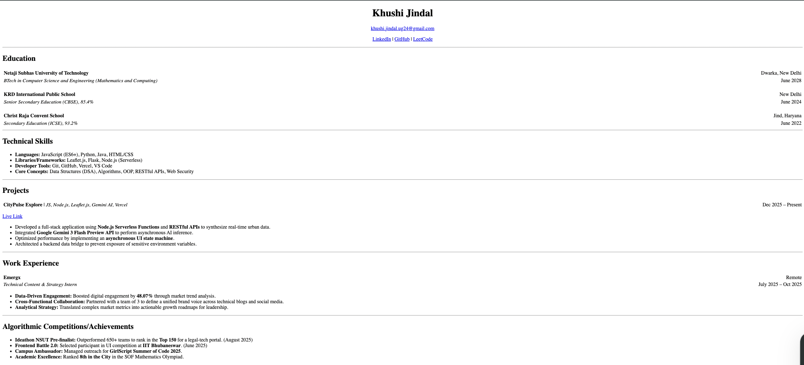

# HTML-Only Resume Website

A clean, single-page resume website built strictly using **HTML**. This project demonstrates the use of semantic HTML tags and table-based layouts to structure professional content without the use of external or internal CSS.

## 🚀 Live Demo
[Insert your GitHub Pages link here]

## 📸 Screenshot
 

## 🛠️ Built With
- **HTML5**: For structure and content.
- **HTML Tables**: Used for alignment and section headers.
- **Semantic Tags**: `<h1>`-`<h2>`, `<ul>`, `<li>`, `<strong>`, and `<em>`.

## 📋 Features
- **Header**: Contact information and professional links centered using HTML attributes.
- **Education & Experience**: Structured using tables to ensure dates are right-aligned.
- **Skills & Projects**: Organized using nested lists for high readability.
- **Responsive-ish Layout**: Uses percentage-based widths to fit different screen sizes.

## ⚙️ Setup & Usage
1. **Clone the repository**:
   ```bash
   git clone https://github.com//HTML_Resume.git
   ```
2. **Open the project**:
   - Navigate to the folder.
   - Double-click `index.html` to view it in your browser.

## 👤 Author
**Khushi Jindal**
- [LinkedIn](https://linkedin.com/in/khushi-jindal)
- [GitHub](https://github.com/UdayiniKhushi)

